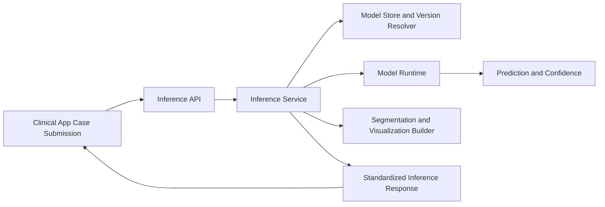

# PneumOrpheus Inference Server

The PneumOrpheus Inference Server is the clinical AI processing service behind the PneumOrpheus platform.
It receives imaging studies and clinical metadata from the PneumOrpheus application, executes model inference, and returns structured, explainable outputs for report generation.

## Service Purpose

- Transform uploaded chest imaging studies into clinically reviewable AI outputs.
- Provide consistent, machine-readable response fields for downstream report workflows.
- Support explainability with confidence, rationale, regional predictions, and visualization-ready segmentation data.
- Operate as an isolated inference layer so model serving can scale and evolve independently.

## Where It Fits in the Platform

PneumOrpheus uses a layered architecture:

- Clinical application layer: case intake, report review, patient tracking.
- Inference server layer (this service): model execution and standardized AI output.
- Clinical data layer: long-term report and patient record persistence in the app domain.

In short, this server is the decision-support computation engine, while the application remains the clinician-facing workflow environment.

## Inference Workflow

1. A new case is submitted from PneumOrpheus with patient and study metadata.
2. The server validates the request and receives study bytes in memory.
3. The selected model artifact is resolved from the configured model source.
4. Runtime inference executes and produces prediction outputs.
5. The server enriches the result with standardized fields.
6. A structured response is returned to the application for report assembly and clinician review.

## System Architecture

### 1) API Gateway Layer

- Exposes inference and service-health endpoints.
- Accepts multipart clinical submission payloads.
- Supports optional bearer-token protection for controlled access.

### 2) Orchestration Layer

- Builds a normalized inference input object from request content.
- Coordinates model artifact retrieval and runtime execution.
- Converts runtime output into the platform response schema.

### 3) Model Artifact Layer

- Resolves model assets from local or cloud-backed model storage.
- Supports model versioning and cached retrieval.
- Enables reproducible model selection by name and version.

### 4) Runtime Inference Layer

- Loads model artifacts and executes forward-pass inference.
- Produces class predictions and confidence estimates.
- Returns structured reasoning and staging fields expected by the clinical application.

### 5) Imaging Visualization Layer

- Builds optional visualization payloads for NIfTI studies.
- Adds slice-level, viewer-friendly segmentation content when available.

## High-Level Data Flow

## Input Contract (Clinical Request)

Each inference request includes:

- Analysis identifier
- Patient identifier
- Patient name
- Imaging modality
- Clinician email
- Study file (DICOM or NIfTI workflow input)

This structure allows deterministic linkage between uploaded study, generated output, and downstream clinical reporting.

## Output Contract (Clinical Response)

Each response can include:

- Case identifiers and processing timestamp
- Source file metadata
- Findings summary
- Predicted cancer type
- Classification confidence
- Reasoning text
- Proposed TNM stage
- Side/region-level classification entries
- Optional segmentation/visualization payload
- Model metadata for traceability

## Privacy and Data Handling

- Study bytes are processed in-memory for inference.
- The inference server focuses on computation and response generation, not long-term study-file archival.
- Security controls can require authenticated bearer access for inbound requests.
- Outputs are returned in a constrained, structured schema to support controlled downstream handling.

## Reliability and Operational Behavior

- Includes a dedicated health endpoint for service availability checks.
- Supports stable and versioned inference routes.
- Uses model caching and deterministic model resolution to reduce runtime volatility.
- Keeps inference logic and model management decoupled to support safer model lifecycle updates.

## Explainability Support

The server is designed to provide interpretable outputs, not just raw class labels.
Depending on model/runtime capabilities, responses may include:

- Confidence-calibrated predictions
- Narrative reasoning text
- Side-level diagnostic suggestions
- Visualization-ready segmentation slices

These outputs are intended to strengthen clinician review, not automate final diagnosis.

## Safety and Intended Use

- The inference server is a clinical decision-support component.
- It is not a standalone diagnostic authority.
- Final interpretation, diagnosis, and treatment decisions remain with qualified healthcare professionals.
- AI outputs should always be interpreted alongside imaging evidence, patient context, and institutional policy.

## Summary

The PneumOrpheus Inference Server provides the model-serving backbone of the PneumOrpheus ecosystem: secure clinical request intake, version-aware model execution, standardized explainable outputs, and integration-ready response delivery for clinician-facing report workflows.
